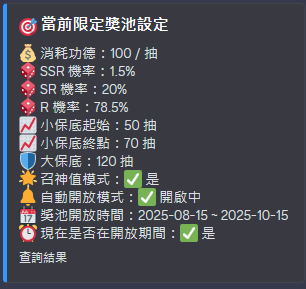
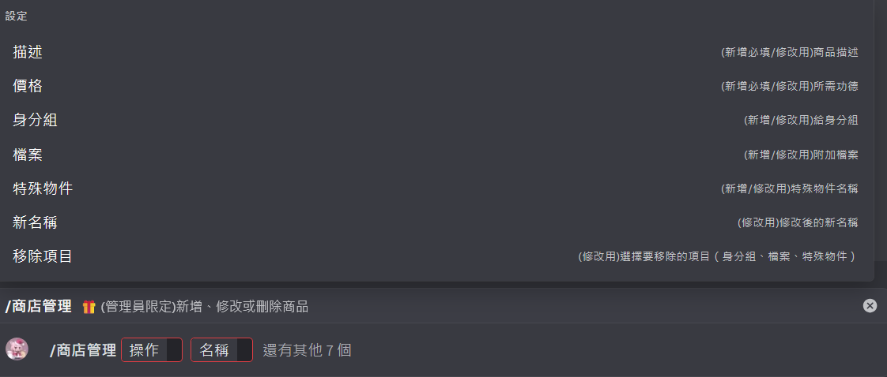

# js-node_DCbot
用node套件運行DC機器人

## 機器人說明
1. 易操作:
- 可在 [.env] 與 [指令.js] 中設定指令全域或者部屬特定伺服器
- [指令.js] 會根據 [dc-bot/指令] 資料夾中有的js檔自動新增指令，無須額外紀錄當前指令
2. 存檔功能:
- 具存檔功能，會儲存玩家資料到[常用/資料庫.json]
- 額外檔案會放到[dc-bot/公用檔案]區，刪除也會有紀錄
- 存檔會根據伺服器不同而分開存檔
3. 娛樂性:
- 具有每日簽到功能/商店功能/抽獎功能/個人檔案功能
- 各類指令標準且多功能，可以給身分組，也可以給檔案，或者自訂特殊物件標籤紀錄


### 展示畫面



## 1.前置安裝
1. 安裝 node.js
2. 安裝node 使用指令:
```
npm install node
npm install discord.js dotenv
```
根據情況可能會有更多需要安裝的

## 2.DC準備
1. 前往這裡創建一個DC機器人: https://discord.com/developers/applications
2. 邀請你的bot進入伺服器，在 OAuth2 那創建邀請連結
3. 前往左側BOT欄位找到、創建一個token

4. 取得機器人token、ID、伺服器ID(記得去開啟開發者模式，才方便右鍵找ID)
5. 將對應的金鑰/ID放入 .env 檔中


## 3.運行bot
1. 前往dc-bot資料夾，開啟終端執行 node 指令
```
node 指令
node index
```
2. 確認指令跟機器人正常運行，即可前往伺服器使用DC機器人